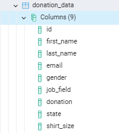
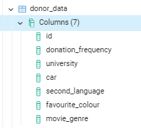

# Charity-Organization-Report

## Table of contents

- [Introduction](#introduction)
   - [Root cause analysis process](#root-cause-analysis-process)
- [Insight from analysis](#insight-from-analysis)
- [Findings](#findings)
- [Recommendations](#recommendations)
- [Conclusion](#conclusion)


---

## Introduction
This project involves presenting data insight of currently received donations from different donors. Two data sets from a charity organization (Education for All) were provided by the 10Alytic team, namely donation data and donor data, both of which contain different pieces of information related to donors’ biodata and their donations. The analysis is structured to extract the below insights from the dataset that will help with the business problem.

1. Total donation and number of donations by gender
2. Total donation made by frequency of donation
3. Total donation and number of donations by job field
4. Total donation and number of donations above, below and equals $200
5. Top 10 states that contributes the highest and the least donations
6. Top 10 cars driven by the highest donors
7. Donors who speak a second language by donation frequency
8. Donors favorite color by donation frequency.


### Root cause analysis process

The business problem is to devise strategies of increasing funds for Education for All charity organizations, using the provided data. 
Specifically, the problem includes: finding ways of increasing the number of donors, donation frequency and amount of donation.
Reasons: Few donors, fewer donations, redundancy in donation.
Result: Wrong audience, lack of motivation, nature of their job, some donors have little education and understand a second language.


## Insight from analysis


All data were imported into the SQL tool (sqliteonline.com) using Postgres IDE and were queried with different codes to obtain insights necessary to increase donations.



               
 
 
 #### 1. **Total donation and number of donations by gender**

The figure below shows that the total donors were 1000 of which 508 were females while 492 were males. The total sums of donations were calculated based on gender and it was found that a total of $121457 (48%) donors were female, using the sequel code below, while male donors were $127628 (52%) donors, making a total of $249085. The following SQL statements were used

``` 
SELECT gender, SUM(donation), COUNT(donation)

FROM donation_data

GROUP BY gender;
```


   
#### 2. **Total donation made by frequency of donation**
Donors donated at different frequencies. The donation frequencies are; Once ($32,666),
Weekly ($31,645), Daily ($29,249), Yearly ($35,266), Seldom ($30,650), Monthly ($26,870),
Often ($28,476), and Never ($34,263).

```
SELECT SUM(donation_data.donation), donor_data. donation_frequency

FROM donation_data

JOIN donor_data

ON donation_data.id = donor_data.id

GROUP BY donation_frequency;
```


#### 3. **Total donation and number of donations by job field**
Total numbers of donations made on each 12 different job fields includes: Business
Development (94), Human Recourses (93), Engineering (93), Product Management (90), Training (84), Research & Development (84), Sales (83), Accounting (80), Services (80),
Support (79), Marketing (74), and Legal (66).

Donors who work in Human Resources donated more money ($23,060) while those that work in Legal ($17309) donated the least. 

California ($30,264), Texas ($24,097), Florida ($20,562), New York ($14,759), Virginia ($10,750), Illinois ($8,674), District of Columbia ($8,376), Tennessee ($8,316), Georgia ($8,046), Ohio ($6,876)

```
SELECT job_field, SUM(donation), 

COUNT(donation)

FROM donation_data

GROUP BY job_field;
```


<div align="right">[ <a href="#table-of-contents">↑ Back to top ↑</a> ]</div>


#### 4. **Total donation and number of donations above, below and equals $200**
The figures below shows that over ~50% (586) of the total numbers of donors donated above $200 with a total donation of $205,892, ~41% (411) of donors donated less than $200 with a total donation of $24,593, while ~1% (3) donors donated $200 with a total donation of $600.

```
SELECT SUM(donation), COUNT(donation)

FROM donation_data

WHERE donation >200; 
```


#
```
SELECT SUM(donation), COUNT(donation)

FROM donation_data

WHERE donation <200;
```


#
```
SELECT SUM(donation), COUNT(donation)

FROM donation_data

WHERE donation = 200;
```


#

#### 5. **Top 10 states that contributes the highest and the least donations**
The total donations per state were estimated to derive top 10 states that donated the highest. The estimation includes: California ($30,264), Texas ($24,097), Florida ($20,562), New York ($14,759), Virginia ($10,750), Illinois ($8,674), District of Columbia ($8,376), Tennessee ($8,316), Georgia ($8,046) and Ohio ($6,876).

```
SELECT state, SUM(donation)

FROM donation_data

GROUP BY state

ORDER BY SUM(donation) DESC

LIMIT 10;
```


While the top 10 states that donated the least are Wyoming ($258), South Dakota ($401), North Dakota ($651), Alaska ($734), West Virginia ($793), South Carolina ($819), New Hampshire ($841), Hawaii ($875) and Montana ($1009) as shown in the figure below

```
SELECT state, SUM(donation)

FROM donation_data

GROUP BY state

ORDER BY SUM (donation) ASC

LIMIT 10;
```


#### 6. **Top 10 cars driven by the highest donors**
Donation by donors’ car. Top 10 cars driven by donors that made the highest donation are; Ford ($22,706), Chevrolet ($19,875), Toyota ($14,123), GMC ($10,145), Mitsubishi ($10,001), Dodge ($9,479), Pontiac ($9,331), Honda ($9,201), Honda ($9,201), Volkswagen ($8,964) and BMW ($8,608).

```
SELECT donor_data.car, SUM (donation_data.donation)

FROM donation_data

JOIN donor_data

ON donation_data.id = donor_data.id

GROUP BY donor_data.car
  
ORDER BY SUM(donation_data.donation) DESC
     
LIMIT 10;
```


#### 7. **Donors who speak a second language by donation frequency.**

```
SELECT donor_data.donation_frequency, COUNT(donor_data.second_language), 
SUM (donation_data.donation)

FROM donation_data

JOIN donor_data

ON donation_data.id = donor_data.id

GROUP BY donor_data.donation_frequency

ORDER BY COUNT (donor_data.second_language) DESC;
```


#### 8. **Donors favorite color by donation frequency.**

```
SELECT donor_data.donation_frequency, COUNT(donor_data.favourite_colour), 

SUM(donation_data.donation)

FROM donation_data

JOIN donor_data

ON donation_data.id = donor_data.id

GROUP BY donor_data.donation_frequency

ORDER BY COUNT(donor_data.favourite_colour) DESC;
```


<div align="right">[ <a href="#table-of-contents">↑ Back to top ↑</a> ]</div>


## Findings

The analysis shows wealth makers (real estates), business tycoons, loyal donors (daily-weekly-monthly), and people with luxurious lifestyles (exotic cars) were identified using various queries, while redundant and uneducated people who understand a second language provided a complete insight into possible targets of donation increment. Gender did not make any difference and donors were higher from certain states than others.
Results showed that a low level of education and ability to speak a second language negatively affected donation. Almost all redundant donors did not have a university degree and consequently did not understand why they should support the charity cause. 

Their job fields cut across many sectors and thus if they are in a country different from where the charity organization is situated and where another language they do not understand is spoken, there is a tendency that they will not respond to emails and invitations. In addition, most of them may have preferred to receive correspondence from the organization from their second language and therefore did not respond well to emails and honor invitations. 


## Recommendations

The charity organization should consider sending emails to redundant donors in their second language or provide translation tools within the email for clients who may prefer to read their letters in a second language. More email marketing strategies and physical representation are needed in states that recorded low donations. This will increase the donations received. 

In regards to increasing the number of donors and value of donations, the charity organization should brand and sell merchandise to the donors. When the organization brands merchandise, such as t-shirt in different size and quality, the supporter(donors) who purchase such product literally becomes marketers for the organization, thus, bringing more donors to the organization. Consequently, building relationship with donors of sound retention; sorting the data of the donors such as the job field that contributes the highest donation, the top cars and top states of donors with the highest donations.

In addition, more programs should be organized for loyal donors, who share the vision of the charity organization and donate daily, weekly, monthly, and yearly basis. Gift items should also be presented to them to show appreciation and renew their commitment as well as encouraging them to increase the value of their giving by highlight the benefits of recurring donations; show the donors of how much impact a small, regular donation can make and then continue to update and engage with news and photos of the development.


## Conclusion

The data shows that ability to speak a second language, a low level of education and lack of motivation can negatively affect the frequency and value of donations received.


<div align="right">[ <a href="#table-of-contents">↑ Back to top ↑</a> ]</div>


