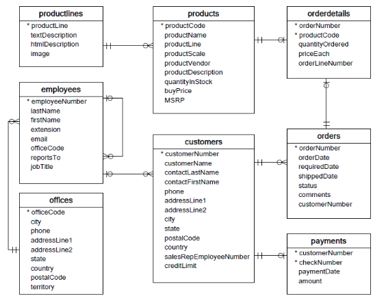
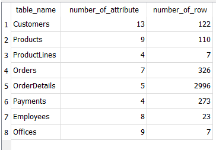
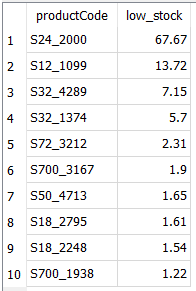
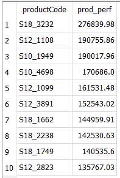
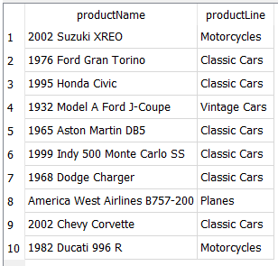
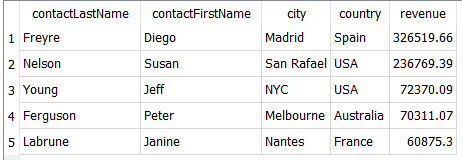
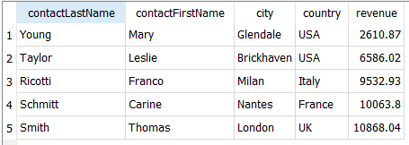
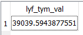

# Customers-Products-Analysis

## Table of contents
- [Introduction](#introduction)
- [Data & Tools](#data-&-tools)
	- [Schema diagram](#schema-diagram)
	- [Database Summary](#database-summary)
- [Analysis Highlights](#analysis-highlights)
- [Key Insights & Recommendations](#key-insights-&-recommendations)


---

## Introduction

This project analyzes sales data from a scale model car retailer using a SQLite database to support data-informed decision-making. The key questions addressed are:

1. Which products warrant restocking or reduction?
2. How can marketing and communication strategies be tailored to customer behavior?
3. What is a sustainable spend threshold for acquiring new customers?

## Data & Tools

- **Database:** Handled via DB Browser for SQLite.
- **Queries:** Custom SQL scripts were used to extract insights from orders, products, and customer data.

### Schema diagram


### Database Summary

 
               
## Analysis Highlights

### 1. Restocking Strategy

- **Low Stock Ratio:** Calculated as ordered quantity divided by in-stock quantity; high values indicate products nearing depletion.

``` 
SELECT productCode, 
       ROUND(SUM(quantityOrdered) * 1.0 / (SELECT quantityInStock
                                             FROM products p
                                            WHERE od.productCode = p.productCode), 2) AS low_stock
  FROM orderdetails od
 GROUP BY productCode
 ORDER BY low_stock DESC
 LIMIT 10;
```



- **Product Performance:** Measured by total sales revenue per product (quantityOrdered × priceEach).

```
SELECT productCode, 
       SUM(quantityOrdered * priceEach) AS prod_perf
  FROM orderdetails od
 GROUP BY productCode 
 ORDER BY prod_perf DESC
 LIMIT 10;
```



- **Priority Restock Items:** Identified products that combine strong sales with limited remaining inventory.

``` 
WITH
  prfrm AS (
    SELECT productCode,
           SUM(quantityOrdered) * 1.0 AS qntOrdr, SUM(quantityOrdered * priceEach) AS prod_perf
      FROM orderdetails
     GROUP BY productCode
  ),
  lstk AS (
    SELECT pr.productCode, 
	       pr.productName, 
		   pr.productLine,
           ROUND(SUM(prfrm.qntOrdr * 1.0) / pr.quantityInstock, 2) AS low_stock
      FROM products pr
	  JOIN prfrm
	    ON pr.productCode = prfrm.productCode
     GROUP BY pr.productCode
	 ORDER BY low_stock
	 LIMIT 10
  )
    SELECT lstk.productName, 
	       lstk.productLine
	  FROM lstk
	  JOIN prfrm
	    ON lstk.productCode = prfrm.productCode
	 ORDER BY prfrm.prod_perf DESC;
```


   
### 2. Customer Segmentation for Targeted Engagement

- **Revenue by Customer:** Computed as quantityOrdered × (priceEach − buyPrice) to determine individual profitability.

``` 
SELECT o.customerNumber, SUM(quantityOrdered * (priceEach - buyPrice)) AS revenue
  FROM products p
  JOIN orderdetails od
    ON p.productCode = od.productCode
  JOIN orders o
    ON o.orderNumber = od.orderNumber
 GROUP BY o.customerNumber;
 ``` 
 
- **Top 5 VIP Customers:** Highest revenue-generating customers; Prime candidates for loyalty incentives.
  
```
WITH 

money_in_by_customer_table AS (
SELECT o.customerNumber, SUM(quantityOrdered * (priceEach - buyPrice)) AS revenue
  FROM products p
  JOIN orderdetails od
    ON p.productCode = od.productCode
  JOIN orders o
    ON o.orderNumber = od.orderNumber
 GROUP BY o.customerNumber
)

SELECT contactLastName, contactFirstName, city, country, mc.revenue
  FROM customers c
  JOIN money_in_by_customer_table mc
    ON mc.customerNumber = c.customerNumber
 ORDER BY mc.revenue DESC
 LIMIT 5;
 ```



- **Bottom 5 Least-Engaged Customers:** Lowest revenue signifiers; focus groups for feedback on pricing and preferences.

```
WITH 

money_in_by_customer_table AS (
SELECT o.customerNumber, SUM(quantityOrdered * (priceEach - buyPrice)) AS revenue
  FROM products p
  JOIN orderdetails od
    ON p.productCode = od.productCode
  JOIN orders o
    ON o.orderNumber = od.orderNumber
 GROUP BY o.customerNumber
)

SELECT contactLastName, contactFirstName, city, country, mc.revenue
  FROM customers c
  JOIN money_in_by_customer_table mc
    ON mc.customerNumber = c.customerNumber
 ORDER BY mc.revenue
 LIMIT 5;
 
```



### 3. Customer Acquisition Budgeting

- **Customer Lifetime Value (LTV):** Derived as the average profit per customer across the dataset.

```
WITH 

money_in_by_customer_table AS (
SELECT o.customerNumber, SUM(quantityOrdered * (priceEach - buyPrice)) AS revenue
  FROM products p
  JOIN orderdetails od
    ON p.productCode = od.productCode
  JOIN orders o
    ON o.orderNumber = od.orderNumber
 GROUP BY o.customerNumber
)

SELECT AVG(mc.revenue) AS lyf_tym_val
  FROM money_in_by_customer_table mc;

```


- **Key Insight:** The LTV amount indicates how much can be reasonably spent to acquire each new customer without sacrificing profitability.


## Key Insights & Recommendations

### 1. Inventory Focus
- Six of the top ten restock candidates belong to the "Classic Cars" line; high sales and low stock suggest prioritizing these for restocking.

### 2. Customer Strategy

- **VIP Customers:** Offer loyalty rewards or personalized services to retain high-value customers.

- **Under-engaged Customers:** Engage them with targeted feedback invitations and promotional offers to boost conversion.

### 3. Acquisition Budgeting

The average customer LTV — approximately $39,040, should inform the maximum acquisition cost to ensure profitable growth.


	          
 <div align="right">[ <a href="#table-of-contents">↑ Back to top ↑</a> ]</div>
                        
